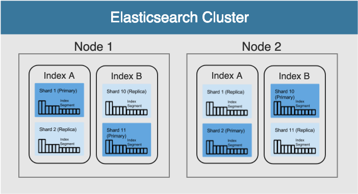
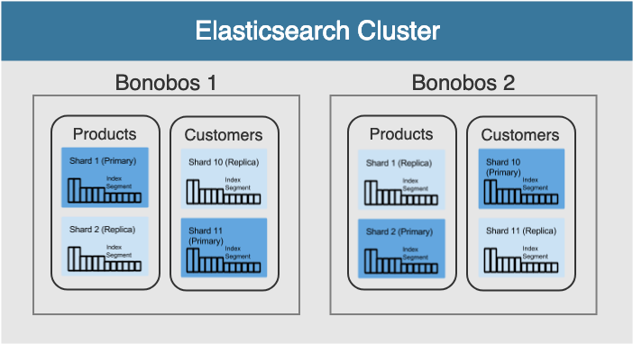
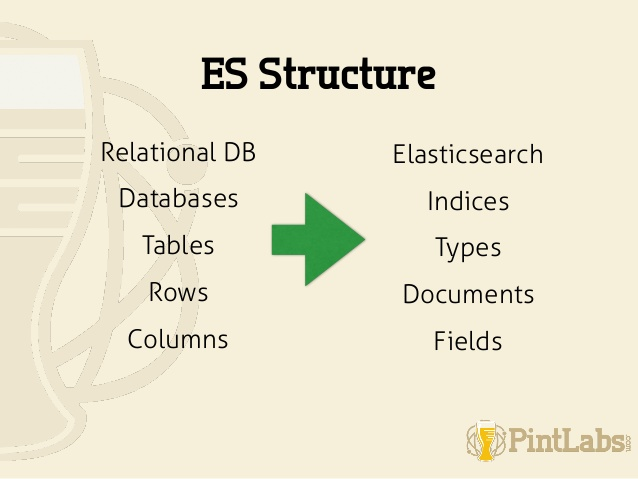

<!-- .slide: data-transition="concave" -->
## 

---

<!-- .slide: data-transition="concave" -->
 <!-- .element height="30%" width="30%" -->
## 1st Hour:
#### Crush the Cluster, Node, Index, and Shard

---

<!-- .slide: data-transition="concave" -->
## Objects:
- Configure a cluster
- Run multiple nodes on 1 machine
- Understand indices, shards and shard replication
- Understand how Elasticsearch uses Lucene
- Perform CRUD for indices and documents
- Understand Optimistic Concurrency Control (_version)
- Perform GET to retrieve multiple objects in 1 request

---

<!-- .slide: data-transition="concave" -->
## What is Elasticsearch?
Elasticsearch is an open-source, readily-scalable, enterprise-grade search engine based on the Lucene text search library. Accessible through an extensive API, Elasticsearch can power extremely fast searches that support your data discovery applications.

---

<!-- .slide: data-transition="concave" -->
## What is Kibana?
"Kibana lets you visualize your Elasticsearch data and navigate the Elastic Stack, so you can do anything from learning why you're getting paged at 2:00 a.m. to understanding the impact rain might have on your quarterly numbers." - Elastic

---

<!-- .slide: data-transition="concave" -->
## Fire up the engines!

```bash
# Launch Elasticsearch
$ cd ~/bonobos/elasticsearch
$ bin/elasticsearch

# Launch Kibana
$ cd ~/bonobos/kibana
$ bin/kibana

# Open Kibana in the browser
http://localhost:5601
```

---

<!-- .slide: data-transition="concave" -->
## [Memory allocation issues?](https://www.elastic.co/guide/en/elasticsearch/reference/6.6/disk-allocator.html)

---

<!-- .slide: data-transition="concave" -->
## It's alive!
```bash
GET /_cluster/health

# Compact and Aligned Text - or cat :)
GET _cat/health
GET _cat/shards
GET _cat/nodes
```

---

<!-- .slide: data-transition="concave" -->
### I love you Elasticsearch.
### You're perfect.
### Now change.
- ctrl + c to stop Elasticsearch
- Open config/elasticsearch.yml
- Change: cluster.name: bonobos
- $ bin/elasticsearch to start
- Note - may need to adjust memory for the new cluster

---

<!-- .slide: data-transition="concave" -->
### 2 Nodes Are Better Than 1
- Open config/elasticsearch.yml
- Add: node.max_local_storage_nodes: 2
- Open new terminal on same machine
- $ bin/elasticsearch

---

<!-- .slide: data-transition="concave" -->
### 2+ Nodes on 2+ Machines Is Best!
[ <!-- .element height="30%" width="30%" -->](https://discuss.elastic.co/t/can-i-run-multiple-elasticsearch-nodes-on-the-same-machine/67)

---

<!-- .slide: data-transition="concave" -->
## Concepts:
### Cluster, node, shard
### Index, type, document, field

---

<!-- .slide: data-transition="concave" -->
|   |   |
|---|---|
| Cluster  | A self-organizing collection of nodes that share data and workload  |
| Node  | A running instance of Elasticsearch. Nodes with the same name form a cluster.  |
| Shard  | A single Lucene instance that contains a sliver of the data in the node |
|   |   |
---

<!-- .slide: data-transition="concave" -->
## <!-- .element height="120%" width="120%" -->

---

<!-- .slide: data-transition="concave" -->
## <!-- .element height="120%" width="120%" -->

---

<!-- .slide: data-transition="concave" -->
## <!-- .element height="60%" width="60%" -->
"Types" is a version 5 concept NOT a version 6 concept

---

<!-- .slide: data-transition="concave" -->
## Dude stop talking!

---

<!-- .slide: data-transition="concave" -->
## Create
```js
// Create index
PUT /products
{
   "settings" : {
      "number_of_shards" : 1,
      "number_of_replicas" : 1
   }
}

// Create document
POST /products/_doc/1
{
  "type":"shirt",
  "color":"black"
}
// 5.6
POST /products/shirt/1
{
  "color":"black"
}
```

---

<!-- .slide: data-transition="concave" -->
## Read
```js
//Read one document
GET /products/_doc/1

//Read all documents
GET /products/_search

//Read some documents
GET /products/_search
{
  "query": {
    "match": {
      "type":"shirt"
    }
  }
}
```

---

<!-- .slide: data-transition="concave" -->
## Update
```js
// Update document
POST /products/_doc/1/_update
{
  "doc": {
    "sleeves": "short"
  }
}
// 5.6
POST /products/shirt/1/_update
{
  "sleeves":"short"
}
```

---

<!-- .slide: data-transition="concave" -->
## Delete
```js
// Delete document
DELETE /products/_doc/1

// 5.6
DELETE /products/shirts/123

// Delete index
DELETE /products
```

---

<!-- .slide: data-transition="concave" -->
## Concept:
### Optimistic Concurrency Control?
#### (and why do I care?)
[documentation](https://www.elastic.co/guide/en/elasticsearch/guide/current/optimistic-concurrency-control.html)<br/>
_version : It's how our shards guarantee data isn't overwritten


---

<!-- .slide: data-transition="concave" -->
## Concept:
### Single GET for multiple objects? Yep!
```js
GET /products/_mget
{
   "ids" : [ "1", "2" ]
}
```

---

<!-- .slide: data-transition="concave" -->
## Objects:
- Configure a cluster
- Run multiple nodes on 1 machine
- Understand indices, shards and shard replication
- Understand how Elasticsearch uses Lucene
- Perform CRUD for indices and documents
- Understand Optimistic Concurrency Control (_version)
- Perform GET to retrieve multiple objects in 1 request

---

<!-- .slide: data-transition="concave" -->
## Awesome!
> Red light, green light?

<!-- .slide: data-transition="concave" -->
## 

---

<!-- .slide: data-transition="concave" -->
## 2nd Hour:
### Search This!

---

<!-- .slide: data-transition="concave" -->
## Objects:
- Load JSON datasets from the console
- Response body searches
- Perform fuzzy searches
- Perform searches based on phrases, proximity, wildcards and regular expressions
- Perform bool queries

---

<!-- .slide: data-transition="concave" -->
[_bulk](https://www.elastic.co/guide/en/elasticsearch/reference/6.6/docs-bulk.html)
```js
// Create customers index
PUT /customers
{
   "settings" : {
      "number_of_shards" : 1,
      "number_of_replicas" : 0
   }
}

POST _bulk
{ "index" : { "_index" : "customers", "_type" : "_doc", "_id":1} }
{ "name" : "Brian" }
{ "index" : { "_index" : "customers", "_type" : "_doc", "_id":2} }
{ "name" : "Jonathan" }
```

---

<!-- .slide: data-transition="concave" -->
## NDJSON
_bulk uses [Newline Delimited JSON](http://ndjson.org/)

---

<!-- .slide: data-transition="concave" -->

### [convert csv to json](https://www.csvjson.com/csv2json)
Remember to replace \n with the index map for each document
### [load json dataset](https://www.elastic.co/guide/en/kibana/current/tutorial-load-dataset.html#_load_the_data_sets)
```bash
$ cp ./data/products.json ./elasticsearch/data/products.json
$ curl -H 'Content-Type: application/x-ndjson' -XPOST 'localhost:9200/products/_bulk?pretty' --data-binary @data/products.json
```

---

<!-- .slide: data-transition="concave" -->
## Confirm everything loaded
```js
// URI search
GET /products/_search?q=name:golf
```

---

<!-- .slide: data-transition="concave" -->
## [Request Body Search](https://www.elastic.co/guide/en/elasticsearch/reference/6.6/search-request-body.html)

---

<!-- .slide: data-transition="concave" -->
### Search Query
```js
// Search 1 field for 1 value
GET /products/_search
{
  "query": {
    "term": {"description": "shirt"}
  }
}

// Search 1 field for 2 values
GET /products/_search
{
  "query": {
    "terms": {"description": ["shirt", "shirts"]}
  }
}
```

---

<!-- .slide: data-transition="concave" -->
### Sort & Size
```js
GET /products/_search
{
  "sort" : [
    { "price" : {"order" : "desc"}}
  ],
  "query": {
    "terms": {"name": ["shirt", "shirts"]}
  }
  "size": 14
}
```

---

<!-- .slide: data-transition="concave" -->
### Range
```js
GET /products/_search
{
  "sort" : [
        { "price" : {"order" : "desc"}}
    ],
    "query": {
        "range" : {
            "price" : {
                "lte" : 200
            }
        }
    }
}
```
[Date, timezome, and more](https://www.elastic.co/guide/en/elasticsearch/reference/6.7/query-dsl-range-query.html)

---

<!-- .slide: data-transition="concave" -->
### Filtering
```js
GET /products/_search
{
  "sort" : [
    { "price" : {"order" : "desc"}}
  ],
  "query": {
    "bool": {
      "must": {
        "query_string": {
          "fields" : ["name","description"],
          "query" : "shirt"
        }
      },
      "must_not": {
        "term": {"name": "pants"}
      }
    }
  },
  "size": 20
}
```

---

<!-- .slide: data-transition="concave" -->
### Fuzzy Search
```js
GET /products/_search
{
    "query": {
       "fuzzy" : {"name" : "shorts" }
    }
}
```

---

<!-- .slide: data-transition="concave" -->
### Phrase Search
```js
GET /products/_search
{
    "query": {
       "match_phrase" : {
         "name" : "short shirt"
       }
    }
}
```

---

<!-- .slide: data-transition="concave" -->
### Proximity Search
```js
GET /products/_search
{
    "query": {
       "match_phrase" : {
         "name": {
           "query" : "short shirt",
           "slop": 1
         }
       }
    }
}
```

---

<!-- .slide: data-transition="concave" -->
### Wildcard
```js
GET /products/_search
{
    "query": {
       "wildcard" : {"name" : "sh?rt" }
    }
}
```

---

<!-- .slide: data-transition="concave" -->
### Regex
```js
GET /products/_search
{
    "query": {
       "wildcard" : {"name" : "sh?rt" }
    }
}
```

---

<!-- .slide: data-transition="concave" -->
### Bool
```js
POST /products/_search
{
  "query": {
    "bool" : {
      "must" : {
        "term" : { "name" : "polo" }
      },
      "filter": {
        "term" : { "color_presentation": "heather" }
      },
      "must_not" : {
        "range" : {
          "prce" : { "gte" : 10, "lte" : 80 }
        }
      },
      "should" : [
        { "term" : { "description": "denim" } },
        { "term" : { "description": "classic" } }
      ],
      "minimum_should_match" : 1,
      "boost" : 1.0
    }
  }
}
```

---

<!-- .slide: data-transition="concave" -->
## Objects:
- Load JSON datasets from the console
- Response body searches
- Perform fuzzy searches
- Perform searches based on phrases, proximity, wildcards and regular expressions
- Perform bool queries

---

<!-- .slide: data-transition="concave" -->
 <!-- .element height="50%" width="50%" -->
## 3rd Hour:
### Complete the Auto-Complete

---

<!-- .slide: data-transition="concave" -->
## We will:
- Launch a React application
- Load data into Elasticsearch
- Connect our React application to Elasticsearch
- Build a product search box with auto-complete functionality

---

<!-- .slide: data-transition="concave" -->
## Let's do this!

---
